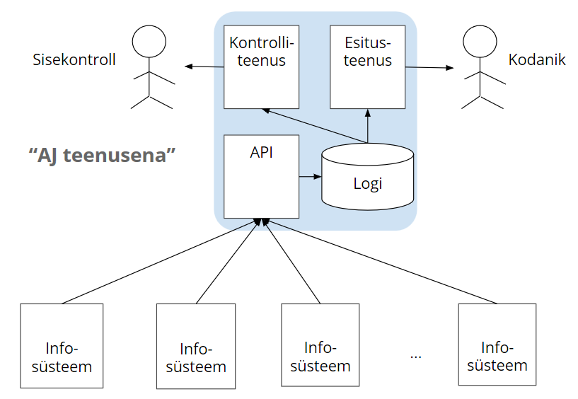

# Andmejälgija 2.0
{: .no_toc}

- TOC
{:toc}

## Sissejuhatus

Andmejälgija, lühendatult AJ, on 2015-2016 RIA poolt arendatud isikuandmete kasutuse jälgimise lahendus. Käesolev dokument esitab ettepanekud AJ edasiarendamiseks.

Isikuandmete töötlemise jälgimise teema on aktualiseerunud. Ühtne andmekaitsemäärus (GDPR) jõustub 2018. a mais. Asutustel tuleb hakata andma andmesubjektidele teavet isikuandmete töötlemise kohta. 

Eriti oluline on täita õigusega pandud kohustus kokkuhoidlike kuludega, kiiresti ja kodanikule mugavalt kasutataval kujul.

Standardlahendused või -komponendid, ühiselt kasutatavad teenused või vähemalt ühtlustatud andmevormingud võimaldaksid GDPR nõuete täitmisel suurt kokkuhoidu.

Seetõttu väärib analüüsi, kuidas AJ võiks GDPR nõuete täitmisel asutustele võimalikult kasulik olla.

## 1 Andmejälgija

Andmejälgija ([https://github.com/e-gov/AJ](https://github.com/e-gov/AJ)) on modulaarse arhitektuuriga standardne lahendus, mis praegu on kasutusel 4-5 asutuses.

### 1.1 Komponendid

AJ komponendid on:

- _Eraldusfilter_ püüab isikuandmete kasutusfakte välja X-tee andmeliiklusest
- _Andmesalvestaja_ kogub ja säilitab isikuandmete kasutusfakte
- _Sisekontrollija rakendus_ võimaldab kogutud kasutusfakte kontrollide asutuse sisekontrolli eesmärkidel
- _Esitusteenus_ võimaldab andmesubjektil eesti.ee-s vaadata isikuandmete kasutusi.  

AJ on ühtaegu nii:

- andmevorming
- andmevahetusprotokoll
- e-teenus
- kui ka erinevatesse asutustesse paigaldatav tarkvara.

### 1.2 Ühtlustatud andmevorming

AJ isikuandmete kasutusandmete ühtlustajana. See on oluline. Ühtlustatud andmevorming võimaldab andmete andmesubjektile näitamist automatiseerida ja aitab tagada andmete mõistetavust.

```
{
  "personcode": "36107120334",
  "logtime": "2018-04-23 T12:04:10",
  "action": "andmepäring",
  "receiver": "Eesti Haigekassa",
  "sender": "Rahvastikuregister",
  "sendercode": "70000562",
  "receivercode": "74000091"
}
```

AJ-s salvestatav isikuandmete kasutuse fakt (HTTP POST päringu kehana (JSON-vormingus))

### 1.3 Andmevahetusprotokoll

AJ-s on fikseeritud viis isikuandmete kasutusandmete edastamiseks eesti.ee-le.

### 1.4 Teenus

Teenusena käsitame rakendust, mida asutus ei pea ise paigaldama ega hooldama. AJ koosseisus on üks teenus - esitusteenus eesti.ee-s. Esitusteenust pakub RIA.

### 1.5 Kogemus

AJ retseptsiooni ei ole süstemaatiliselt uuritud. Seetõttu tuleb arvestada siinsete hinnangute subjektiivsusega.

eesti.ee kasutusstatistika näitab AJ suhteliselt suurt kasutajaskonda (kuni 10 000 unikaalset kasutajat kuus). Need andmed vajaksid siiski kontrollimist.

Riigi Infosüsteemi Ametini ei ole jõudnud suuri kaebusi ega probleeme ei andmesubjektidelt ega AJ-t käitavatelt asutustelt. See tõendab AJ kontseptsiooni elujõulisust. 

Siiski ei ole selge, kui palju andmesubjektid AJ andmetest kasu saavad (ja kuidas nad seda kasu tajuvad). AJ abil ei ole teadaolevalt avastatud suuri, meediasse jõudnud isikuandmete töötlusnõuete rikkumisi. Kuid võib-olla, et rikkumisi polegi olnud.

Võib päris kindlalt väita, et AJ ja analoogilised lahendused aitavad teha e-riigi toimimist kodanikule läbipaistvamaks ja arusaadavamaks ning selle kaudu suurendavad usaldust riigi vastu.

## 2 AJ edasiarendusettepanekud

Edasiarenduse all mõistame nii tarkvaraarendust kui ka toetavaid standardimis- ja kommunikatsioonitegevust, samuti lahenduste pakkumist pilveteenustena.

### 2.1 Laiendada andmejälgijaga haaratavate töötlussündmuste hulka

Praegu on fookus kahel töötlusliigil:
- andmete vaatamine (kes on andmeid vaadanud?)
- andmete edastamine teise andmekogusse (X-teega)

Lisada:
- andmete salvestamine
- andmete kustutamine

Tehniliselt on see ka praeguses lahenduses võimalik (`action`). Küsimus on metoodiline.

### 2.2 Keskse esitusteenuse aktiivne propageerimine

Isikuandmete töötlusandmete keskne vaatamiskoht on oluline. Praegu on eesti.ee esitusteenuse kasutamine vabatahtlik.
 
Lisada kohustus pakkuda isikuandmete töötlusandmeid eesti.ee-s.

### 2.3 Esitusteenuse kasutatavuse tõstmine

Olukord pole halb, kuid esitusteenus upub riigiportaali arvukate artiklite ja teenuste hulka. Esitusteenus võiks olla paremini ülesleitav. 

_Paralleelina Ervinal, kunagine efektne visuaalne vastus küsimusele "Mida riik minu kohta teab?"_

Palju arutatud küsimus on kas kodanik peaks saama andmed ühe päringuga. (Praegu peab iga andmekogu eraldi avama).

### 2.4 Andmesubjekti kohta kogutavate andmete koosseisu kättesaadavaks tegemine

Jutt on metaandmetest, s.t mitte andmeüksus ise, vaid andmeüksuse kategooria. RIHA kogemuse põhjal võib väita, et piirajaks on siin mitte tehniline lahendus, vaid asutuste valmisolek andmekoosseise asjakohasel abstraktsioonitasemel ja arusaadavas keeles kirjeldada.

Oleks küll loogiline ja ilus ning looks lisaväärtust, kui andmesubjekt saaks andmetöötlusfaktide nimekirja (ja see nimekiri võib olla tühi) kõrval ka loetelu andmekogus tema kohta hoitavatest andmetest (andmekategooriatest).

### 2.5 Andmesubjekti kohta säilitatavate andmete kuvamise lisamine

### 2.6 "AJ teenusena"

#### 2.6.1 Konfigureerimise, paigaldamise ja haldamise talumatu kergus

AJ praegune versioon on arendatud tarkvarana, mida asutus peab oma infosüsteemidega ja oma IT-taristusse sobitama, konfigureerima ja paigaldama. Praegune tarkvara on tehtud paindlikuna, seda saab paigaldada mitmel erineval viisil, suuremas või väiksemas komplektis. See nagu peaks suurendama tarkvara kasutust, kuid samas lisab keerukust. AJ tarkvara ise ei ole keeruline,selles ei ole erilisi algoritme. Tegu on nn plumbing tüüpi lahendusega. Seetõttu on paljudel asutustel kiusatus teostada AJ funktsionaalsus ise.

Paljudele asutustele on takistuseks isikuandmeid töötlevate infosüsteemide suur arv. Kümnetes.
AJ on projekteeritud paigaldatavana ühe andmekogu külge (selle põhjuseks 2016. a oli tahtmine hoida disain lihtsana ja vältida "superandmebaasi" teket).
Asutus peab paigaldama Postgre andmebaasi, turvama ja haldama seda. 40 infosüsteemi puhul on vaja 40 AJ instantsi. Seetõttu tuntakse huvi (Tallinna Linnavalitsus), kas AJ saaks toetada enamat kui üht andmekogu.

Oskusliku seadistusega võiks see isegi praegu olla võimalik (andmete hoidmine ühes PostgreSQL instantsis, eraldi schema-des). Kuid ei tohi alahinnata barjääri, mida keerukama konfigureerimise vajadus AJ kasutuselevõtmisele püstitab. (2016. a viidi läbi AJ paigaldamine viies pilootasutuses. Need olid tavalisemast kõrgema IT-võimekusega asutused. Kuid ka neis võttis AJ seadistamine ja paigaldamine kuid).

***Paigaldamist nõudva tarkvara arendamine ei ole perspektiivne.***

#### 2.6.2 "AJ teenusena"

 tähendaks, et 
- asutusele pakutakse lihtsat REST API-t, millega asutus saab isikuandmete töötlust logida.
- isikuandmete logi peetakse "pilves". S.t logi salvestamine, säilitamine, turvamine ja haldamine on teenusepakkuja kätes
- logi hoitakse asutuse või andmekogu lõikes.
- isikuandmete logi tehakse kättesaadavaks ainult kahele sihtrühmale:
  - andmesubjekt ise
  - andmeid logiva asutuse sisekontroll
- isikuandmete logile seatakse säilitustähtaeg, nt üks aasta.
- andmesubjektile pakutakse logiga tutvumiseks veebipõhist e-teenust.
- teenus tehakse kättesaadavaks eesti.ee alt, kuid võib olla iseseisva "brändinguga"



REST API, üle avaliku interneti. Turvatud API võtmega.

### 2.7 AJ protokolli selgem väljatoomine

AJ kui protokoll on hea - kuid protokoll pole piisavalt selgelt välja toodud. Üks võimalus on AJ protokoll selgemalt välja tuua. Eesti tingimustes peame siiski arvestama, et protokoll üksi ei pane asju liikuma.

