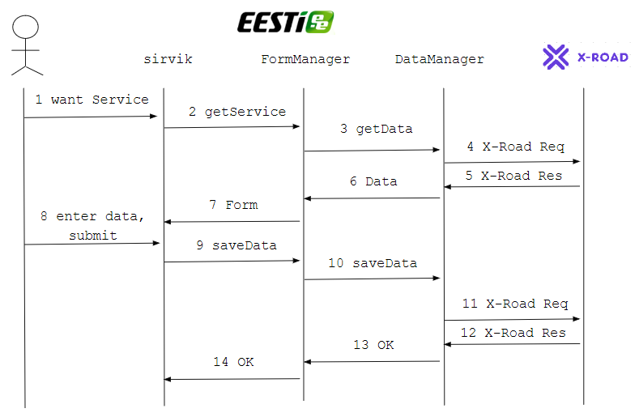

## Tehniline voog

Osapooled ja komponendid:
- __Kasutaja__, riigiportaali kasutav kodanik
- sirvik
- __FormManager__, riigiportaali backend-i komponent, mis:
  - pärib teenuse osutamiseks vajalikud andmed DataManager-lt
  - moodustab teenuse vormi (HTML-i ja Javascript-i)
  - ja saadab selle sirvikusse
  - võtab vormi täitmise tulemuse (tulemandmed) sirvikust vastu
  - ja edastab DataManagerile
- __DataManager__, riigiportaali backend-i komponent, mis:
  - pärib teenuse osutamiseks vajalikud andmed X-teelt
  - ja edastab need FormManager-le
  - võtab teenuse tulemandmed vastu FormManager-lt
  - ja salvestab X-tee päringu(te) abil X-tee andmekogu(de)sse

Voog

 samm | selgitus | tehnoloogia
want Service | Kasutaja on riigiportaali artikli lehel. Kasutaja on autenditud. Kasutaja vajutab teenuse lingile või nupule. | HTML5, CSS3, Javascript, Bootstrap
getService | Sirvikust läheb päring backend-i.  Päringuga haaratakse kaasa sirvikus salvestatud seansiküpsise väärtus (JWT). | Javascript Fetch API* 
getData | FormManager kontrollib seansiküpsise ehtsust ja kehtivust;  saab seansiküpsisest kätte Kasutaja isikukoodi.  Moodustab teenuse esitamiseks vajalike andmete päringu ja saadab selle DataManagerile. | JWS (JSON Web Signature), Java, JSON või XML (päringus DataManager-le) 
X-Road Req | DataManager moodustab X-tee päringu(d) ja saadab selle (need) andmekogu(de)sse. | X-Road, SOAP, WSDL
X-Road Res | DataManager võtab vastu X-tee vastuse(d) | X-Road, SOAP, WSDL
Data | DataManager saadab andmekogu(de)st saadud andmed edasi FormManagerile. | JSON või XML
Form | FormManager moodustab vormi ja täidab selle andmekogu(de)st saadud andmetega. Edastab vormi sirvikusse (päringu getService vastusena).  Vorm koosneb HTML-st ja Javascript-st; vajadusel võib vormiga koos saata ka teenusespetsiifilise laadilehe.  HTML ja Javascript võib osaliselt või tervikuna olla juba artiklilehe koosseisus (ära peidetult). | XForms, Orbeon, Java
enter data, submit | Kasutaja interakteerub vormiga.  Kasutaja vajutab salvesta vms. | HTML5, CSS3, Javascript, Bootstrap
saveData | kasutaja submit-i toimel tehakse sirvikust teenuse tulemandmete salvestamise päring backend-i. | Javascript Fetch API
saveData | FormManager kontrollib sirvikust tulevaid andmeid ja edastab need DataManagerile | Java; JSON või XML
X-Road Req | FormManager koostab andmete salvestamise X-tee päringu(d) ja saadab need asjakohas(t)esse andmekogu(de)sse. | X-Road, SOAP, WSDL
X-Road Res | FormManager võtab vastu X-tee päringu(te) vastuse(d). | X-Road, SOAP, WSDL
OK | Teenuse tulemandmete salvestamise kinnitus liigub tagasi sirvikusse. | Javascript Fetch API

* vanema nimetusega AJAX-päring. Fetch API on HTML5 AJAX-päringute tegemise uus standardne vahend.
