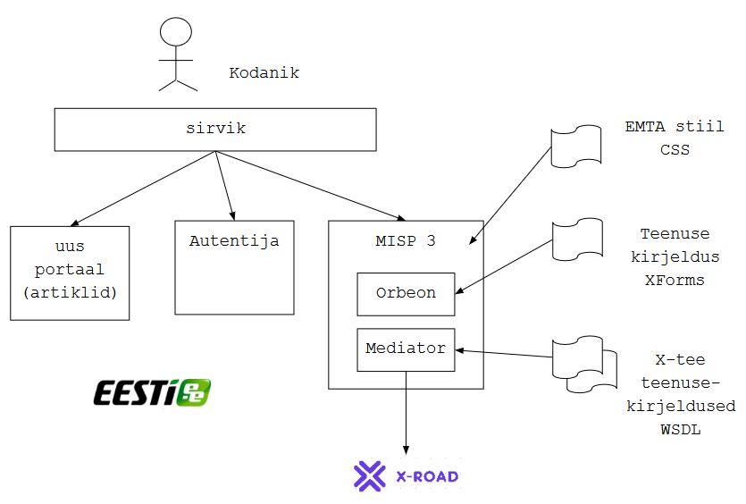

## MISP 3 Proof of Concept. Tööde kirjeldus
{: .no_toc}

14.03.2018

- TOC
{:toc}

### Eesmärk

Luua tehniline lahendus, koodnimetusega MISP 3, mis põhineb:
- MISP2 täiendatud [1] tarkvaral
- eraldiseisval autentimisteenusel (Autentija)
- _responsive_ kujundusel, EMTA stiili alusel
- "vana" portaali XForms teenusekirjeldustel.

Tehniline lahendus peab võimaldama olemasolevaid portaali teenuseid kasutada:
- uues, responsive kujunduses
- väiksemate sõltuvustega vana portaali komponentidest (AAR, portaali raamistik jms)

Tehniline lahendus peab teostama kasutusvoo:

1. Kodanik leiab "uues" portaalis artikli juures talle huvipakkuva teenuse
2. Kodanik logib portaali sisse (autenditakse)
3. Kodanik avaldab soovi kasutada teenust
4. MISP 3 tõmbab X-tee abil andmekogudest vajalikud andmed
5. MISP 3 genereerib ja eeltäidab vormi ning esitab vormi kasutajale
6. Kodanik kasutab vormi (teeb toimingu)
7. MISP 3 salvestab kasutaja toimingu tulemuse vajalikku andmekogusse.

Joonis 1. 

### Tehnilised nõuded

1. Autentimine tehakse eraldi paigaldatud mooduliga (Autentija). Autentimise tulemuseks on JWT-vormingus seansitõend. Seansitõendit hoitakse sirvikus, küpsises. Rakendus peab kontrollima seansitõendi kehtivust. Autentijas hoitakse nimekirja tühistatud seansitõenditest. Autentija kood ja dokumentatsioon [2] on olemas.
2. Peab arvestama perspektiiviga autentimisel kasutada [TARA teenust](https://e-gov.github.io/TARA-Doku/).
3. Kasutajaliideses kasutada kujundusraamistikku Bootstrap ja EMTA stiililaade [3].
4. Vormimootorina kasutada MISP 2 olemasolevat Orbeoni.
5. X-teega suhtlus teostada eraldi komponendiga, võttes aluseks MISP 2 vastava komponendi (joonisel nimetatud Mediatoriks).
6. MISP 2 koodist eemaldada mittevajalik osa (pääsuhaldus, mis ei ole vajalik kodanikuteenustes, menüüd ja teenuste nimekirjad, mis ei haaku uue portaali infoarhitektuuriga).
7. MISP 3 paigaldatakse uuest portaalist ja Autentijast eraldi (kuid kasutab sama domeeni).
8. MISP 3 peab olema portaali paigaldatav mitmes instantsis (iga instants teostab erinevaid teenuseid).

### Proof of concept

Tehniline lahendus koostada _proof of concept_ (POC) ulatuses. See tähendab, et dokumentatsioon, kujundus jm ei pea olema viimistletud, kuid lahendus peab töötama määral, mis võimaldab veenduda lahenduse ärilises sobivuses ja tehnilises teostatavuses.

### Tööde koosseis

| nr | töö | selgitus |
|:-----:|-----|---------|
|  1  | Autentimise eraldamine | Eraldada autentimine eraldi moodulisse.  Autentimismoodul peab võimaldama kasutada nii staatilist portaali kui ka MISP-teenuseid kasutaja ühekordse autentimisega. |
|  2  | UI uuendamine | Vahetada MISP-i kujundus välja Bootstrap-põhise, _responsive_ võimalustega kujundusega.  Aluseks on tellija antud stiiliraamat koos kujunduselementidega. |
|  3  | MISP-i sidumine staatilise portaaliga |  |
|  4  | Mittevajaliku pääsuhalduse eemaldamine | Eemaldada kodanikuteenuste osutamiseks mittevajalik funktsionaalsus. |
|  5  | Teenuste ülekandmine | Viia vähemalt kaks vanas portaalis olevat kodanikuteenust üle uude lahendusse. |

### Üleantavad tulemid

| nr | tulem | selgitus |
|:-----:|-----|---------|
|  1    | arhitektuuridokument | esitab ja spetsifitseerib: lahenduse eesmärgi, liidesed, komponentide koosseisu ja tehnilised omadused, toetatud kasutuslood, sõnumivahetuse jms tehnilised vood; sisaldab arhitektuurijoonist; võib olla nimetatud tehniliseks spetsifikatsiooniks. Ei pea olema viimistletud. |
|  2    | paigaldusjuhend |  |
|  3    | töötav kood |  |
|  4    | POC lahenduse esitlus tellijale | |

#### Viited

[1] Aktors OÜ (2015) MISP2 arhitektuur v 1.10. 
[2] Riigi Infosüsteemi Amet (2017) eesti.ee autentimislahenduse tehniline lähteülesanne. 
[3] EMTA (2018) Kujunduslahendus.