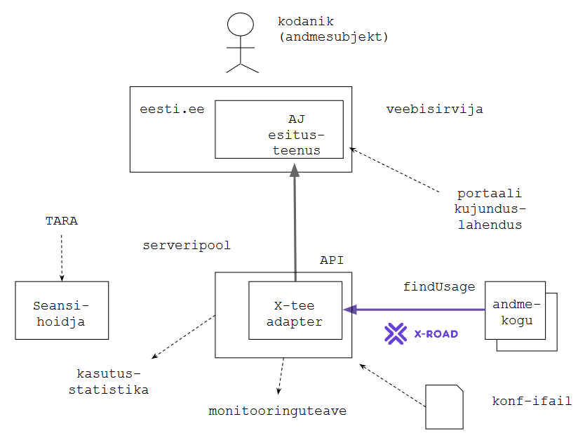

# AJ esitusteenus
{: .no_toc}

_arenduskava_

12.06.2018

Andmejälgija, [https://github.com/e-gov/AJ](https://github.com/e-gov/AJ), (AJ), on standardne protokoll ja tarkvara, mille paigaldamisega saab asutus kodanikule pakkuda ülevaadet (logi) kodaniku isikuandmete kasutamisest.

AJ esitusteenus võimaldab kodanikul tutvuda kõigi andmekogude AJ-logidega. Esitusteenust pakub eesti.ee.

Eesmärk (III-IV kv 2018) on uuendada praegust piiratud võimalustega ja vananenud platvormil toimivat eesti.ee AJ esitusteenust:
- võimaldada kodanikule päringuid üle kõigi andmekogude
- uuendada platvorm.

Ideaallahenduse (vt joonis) põhiomadused:

1 | Kodanik (andmesubjekt) saab ühtse, agregaatlogi, mis koondab andmeid kõigist AJ toetusega andmekogudest
2 | AJ esitusteenust pakutakse eesti.ee domeeninime all
3 | Kodanik autenditakse eesti.ee-s, TARA abil
4 | AJ esitusteenus tugineb eesti.ee seansihoidjale (_session management_)
5 | AJ esitusteenuse koosseisus on komponent (X-tee adapter), mis teeb päringud andmekogude `findUsage` teenuste poole, teisendab saadud andmed JSON-kujule ja pakub neid API kaudu veebisirvikus töötavale UI-le.
6 | AJ esitusteenuse kujunduslahendus kasutab eesti.ee kujundust (mille aluseks on EMTA litsentseeritud kujundus)
7 | sirvikus töötav komponent on lahendatud ühelehelahendusena (SPA). Vajadusel kasutatakse sobivat veebiraamistikku, nt Angular.
8 | AJ esitusteenust seadistatakse konfiguratsioonifaili abil. Eraldi haldusliidest ei tehta.
9 | AJ on võimeline edastama statistikateavet - push välisesse statistikakogumisteenusesse.

Statistikakogumise vajadus analüüsitakse läbi. Statistikakogumine ei tohi saada andmekaitseliseks ohuks.
{:.note}

10 | AJ on võimeline väljastama elutukseteavet välisesse monitooringusüsteemi.

NB! Ettevaatust sõltuvuste lisamisega! Kõik absoluutselt mittevajalik on ballast.
{:.adv}

AJ esitusteenus tõenäoliselt ei ole nii suur, et vääriks omaette (duubeldatud) masinat, andmebaasi jms. AJ esitusteenus peab sobituma eesti.ee kujundusloogikasse ja kasutaja liikumine portaali erinevate teenuste vahel ei tohi olla tõkestatud. Samas tuleks vältida seoseid komponentidega, mis ei ole absoluutselt vajalikud.