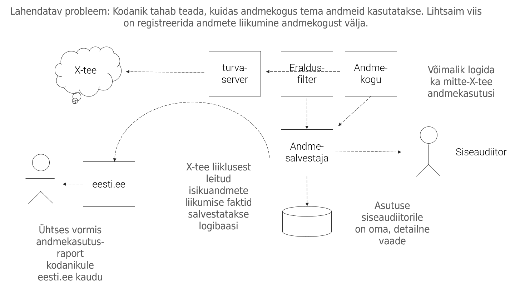

# Soovitusi andmejälgija rakendamiseks
{: .no_toc}

- TOC
{:toc}

Andmejälgija (AJ) rakendamisel tõusetub küsimusi, mis vajavad vastust. Samuti koguneb asutustel kogemusi, mis väärivad levitamist. Käesolevas teabekirjas anname soovitusi AJ-ga pakutava teabe informatiivsemaks tegemiseks.

Kuidas hõlpsamini vastata kodanikele, kes AJ-s isikuandmete töötluse logiga tutvumise järel soovivad täpsemaid selgitusi?
{.adv }

AJ on automatiseeritud lahendus - selles mõttes, et isikuandmete töötluse faktid (logikirjed) salvestatakse X-tee andmeliiklusest eraldusfiltri töötlusreeglite automatiseeritud rakendamisega ja logikirjed esitatakse andmesubjektile eesti.ee-s iseteeninduse põhimõttel.

Logikirjed peavad olema kodanikule arusaadavad, äraseletavad ja vastama kodaniku küsimustele. Kuidas seda - seletamist - automatiseerida?

Seejuures tuleb märkida, et seletuse andmise täielik automatiseerimine ei ole võimalik. 
{.note}

## Selgitusvajadus 

Andmesubjektil võib olla mitte üksainus, vaid kimp üksteisega seotud küsimusi.

- Miks minu andmeid töödeldi?
- Mille alusel? 
- Miks toiming, mille raames andmeid töödeldi oli vajalik?
- Miks just need andmed?
- Milleks üks või teine andmeelement oli vajalik?
- Kas edastati ainult minimaalselt vajalik andmete komplekt?
- Kas andmete edastamine oli põhjendatud?
- Mis andmetest edasi sai?
- Kas andmed edastati turvalisel viisil?
- Kas keegi teine võis veel andmetel ligi saada?
- jne

AJ kasutamispraktika on veel nii väike, et empiiriline andmestu kodanike seletussoovide kohta puudub. Siiski võib eeldada, et küsimusi tekib.

Ammendav seletus - osaline seletus - osalise seletus koos viitega lisateabele - viide lisateabele - 
Kodanik võib tahta teada konkreetse andmebiti edastamise asjaolusid. Terviklike, kodanikele mugavate e-teenuste osutamiseks, aga samuti avaliku halduse mitmesuguste teiste ülesannete täitmiseks on sageli vaja kombineerida andmeid erinevatest andmekogudest. Teenuse osutamiseks ja isegi selle taustal võidakse teha mitmeid päringuid. Atomaarse andmepäringu mõistmine on tihti võimalik ainult teenuseosutamise või avaliku ülesande täitmise laiemat konteksti omades. Teiste sõnadega, kodanikul on tema kohta käiva andmetöötluse mõistmiseks vaja "suuremat pilti".

Kuidas seda "suuremat pilti" kodanikule anda? Asutus saab kasutada mitmeid võimalusi.

## Menetluse/toimingu nimetus (väli `action`)

AJ logikirjes esitatakse menetluse või toimingu nimetus väljas `action`.

Pöörata välja `action` informatiivsusele erilist tähelepanu. 
{.note }

Välja `action` saab täita kolmel viisil.

### Staatiline

Välja `actioncode` võib täita staatiliselt või dünaamiliselt.

X-tee andmevahetusest tekkiv logikirje moodustatakse eraldusfiltris. Eraldusfiltri seadistamisel määratakse töötlusreegel välja `actioncode` täitmiseks. Tehniliselt on töötlusreegel XPath avaldis, mis kombineerib ühest või mitmest X-tee sõnumi väljast kokku välja `actioncode` väärtuse. Väli `actioncode` esitatakse eesti.ee-s andmesubjektile.

Valida välja `actioncode` staatiline väärtus hoolikalt.
{.note }

Eraldusfiltri seadistamisel saab seada igale X-tee teenusele vastava `actioncode` teksti.  

### Dünaamiline

Moodustada välja `actioncode` väärtus dünaamiliselt
{.note }

XPath avaldises saab kasutada nii:
- X-tee standardseid päiseelemente
- sõnumi keha (SOAP-sõnum) elemente
- kui ka X-tee täiendavaid päiseelemente.

Vaatleme nimetatud võimalusi lähemalt.

X-tee standardsetest päistest pakub suurimat huvi `issue`. Päis `issue` on mõeldud menetluse, juhtumi või toimingu masinloetava identifikaatori (numbri) edastamiseks. Sõltuvalt menetluste nummerdamise praktikast võib päis `issue` olla täidetud või tühi. Märgime, et menetlusnumbri esitamine kodanikule ei lahenda iseenesest seletamisprobleemi. Menetlusnumbri kõrval tuleks anda viide asutuse menetlussüsteemi avalikule liidesele, kust kodanik saaks menetlusega lähemalt tutvuda.

Sõnumi keha on SOAP standardile vastava XML-andmestruktuur. XPath töötlusreegliga saab sealt vajaliku teavet eraldada ja logikirjesse (välja ´action` kanda). Sõnumi keha võib seletuse koostamisel olla väga oluline teabeallikas. Abiks on X-tee levinud praktika peegeldada päringsõnumi sisu vastussõnumis. 

X-teel andmeid vahetavad asutused võivad kasutada täiendavaid päiseelemente.

### Käsitsi sisestatav

See moodus on mõeldav juhul, kui logikirje salvestatakse Andmesalvestajasse otse (vt skeemil - "mitte-X-tee andmekasutuste logimine") ja töötleja on asutuse töötaja. Asutuse töötaja sisestab iga  andmekasutustoimingu kohta seletuse, mis salvestatakse Andmesalvestajasse (välja `action`). Selline käsitsitöö on praktiline tõenäoliselt vaid siis, kui seletuse koostamine on tööprotsessi osa.

## Eraldi selgitustekst

Iga andmetöötlusfakti eraldi seletamine ja põhjendamine AJ logikirjes võib olla ebapraktiline. Kirjeldus läheks korduvaks ja pikaks. 

Soovitame asutustel kaaluda eraldi selgitusteksti koostamist. 

See tekst võib olla pikem ja anda andmekogus toimuvast isikuandmete töötlusest laiema pildi.

AJ esitusteenuses eesti.ee-s saab üles panna teksti, mis selgitab antud andmekogus toimuvat isikuandmete töötlust.

## Andmetöötluspoliitika

Konteksti loomiseks ja kodaniku rahustamiseks võib suureks abiks olla hästi koostatud isikuandmete töötluse poliitika.

Kui andmekogul või infosüsteemil on avalik kasutajaliides, siis saab andmetöötluspoliitika dokumendi avaldada seal.

Andmetöötluspoliitika dokumendi saab avaldada ka RIHAs, [https://www.riha.ee](https://www.riha.ee).

## Isikuandmete töötluse mõjuanalüüs

Kodanik võib soovida kindlust andvat teavet selle kohta, et tema isikuandmete töötlus on põhjendatud, minimaalne ja asjakohased kaitsemeetmed on rakendatud. Vastust võib pakkuda isikuandmete töötluse m
mõjuanalüüs (ühtse andmekaitsemääruse valguses). 

Hea koht mõjuanalüüsi ja rakendatud kaitsemeetmete kohta teabe avaldamiseks on RIHA.

## Protsessikirjeldus

Kasutuskonteksti kirjeldus. Kodanik võib soovida täiendavat teavet menetlusprotsessidest jm avaliku sektori infotöötluse äriloogikast, mis tingisid vajaduse tema andmete töötluse järele.

Seda teabevajadust on otstarbekas rahuldada juhatusega RIHA-s avaldatud andmekogu arhitektuuri- ja protsessikirjelduste ning andmemudelite juurde. 

## Standardimisvajadus

Kas X-teel ja/või AJ-s tuleks standardida täiendavaid kirjelduselemente, mis aitaksid selgitusvajadusi rahuldada? 
{.adv}

Selliseks elemendiks võiks olla 'PÄRINGU PÕHJUS' (`requestreason`). Esitame järgnevalt kirjelduselemendi 'PÄRINGU PÕHJUS' ettepaneku.

Ootame ettepaneku kohta arvamusi. Ettepanekut saab eksperimentaalselt kohe praktikas kasutada. Elemendi `requestreason` kohustuslikuks muutmist peame otstarbekaks alles konsensuse ja eksperimentaalse kasutuspraktika tekkimise järel.

Märgime, et üldise kohustuse panemisega (`requestreason` igas X-tee päringus) peab olema ettevaatlik. Kohustuse panemine iseenesest ei taga paremat andmekvaliteeti. Kirjelduselemendist on pigem kahju, kui seda hakatakse täitma formaalselt. Järelevalveks, arvestades tuhandeid X-tee teenuseid, ei ole ressurssi. Seetõttu standard saab välja kasvada asutuste endi kujundatud praktikast. 

## Kirjelduselement `requestreason`

Kirjelduselement `requestreason`:
- esitatakse X-tee päringsõnumi päises
- või sõnumi kehas
- ja peegeldatakse X-tee vastussõnumis
- ei ole kohustuslik
- sisaldab inimloetavas keeles, andmesubjektile mõistetavat vastust küsimusele "Miks andmeid edastati?"
- on tekstiväli
- kasutatav AJ välja `action` koostamiseks AJ eraldufiltri automatiseeritud töötlusreegli abil.

## LISA 1. AJ ülevaade

Andmejälgija, [https://github.com/e-gov/AJ](https://github.com/e-gov/AJ), (AJ), on standardne protokoll ja tarkvara, mille paigaldamisega saab asutus kodanikule pakkuda ülevaadet (logi) kodaniku isikuandmete kasutamisest.

## LISA 2 AJ logikirje

AJ protokoll näeb ette iga isikuandmete töötlemise fakti salvestamist 13 andmeväljast koosneva logikirjena.

Andmeväljad jagunevad andmesubjektile esitatavateks ja asutuse sisekasutuseks mõeldud, tehnilisteks andmeväljadeks. Lähemalt on andmeväljadest juttu AJ [tehnilises dokumentatsioonis](https://github.com/e-gov/AJ/blob/master/doc/spetsifikatsioonid/Tehniline_kontseptsioon.md) ja [paigaldusjuhendis](https://github.com/e-gov/AJ/blob/master/doc/Paigaldamine.md#h%C3%A4%C3%A4lestamine)).

### Andmesubjektile esitatavad andmeväljad

Logikirjed kuvatakse andmesubjektile (s.t kodanikule) eesti.ee AJ kuvamisteenuses. Avalikud andmeväljad on järgmised:

nr | nimetus    | tüüp       | kohustuslik | semantika
---|------------|------------|-------------|------------
1  | `personcode` | tekst | ei          | Isikukood: kelle andmeid töödeldi. Peab algama riigi prefiksiga EE.
2  | `logtime` | datetime   | jah         | Logikirje salvestamise aeg. Eeldatakse, et tegelik andmete kasutamise aeg on lähestikku.
3  | `action` | tekst  | jah | Menetluse/toimingu inimloetav nimetus. Tuletatakse kas X-tee päringu nimest ja/või seatakse andmetöötleja poolt. Võib, aga ei pruugi langeda kokku väljaga `actioncode` s.o sisekasutuseks ettenähtud nimetusega. 
4  | `receiver` | tekst | ei | Asutus, kellele andmed väljastati. Täidetakse andmete väljastamisel andmekogust teisele asutusele X-tee kaudu. Anda asutuse inimloetav nimi.
5  | `sender` | tekst | Asutus, kellelt andmed saadi. Täidetakse andmete saamisel teisest asutusest X-tee kaudu. Anda asutuse, vajadusel ka andmekogu inimloetav nimi.

## Sisekasutuseks mõeldud andmeväljad

nr | nimetus    | tüüp       | kohustuslik | semantika
---|------------|------------|-------------|------------
6  | `id`         | integer    | jah         | Logikirje identifikaator
7  | `restrictions` | char | ei | Kui väärtus ei ole `A`, siis logikirjet eesti.ee-s ei kuvata.
8  | `receivercode` | tekst | ei | Asutuse või andmekogu registrikood/sisekasutuse nimi, kellele andmeid edastatakse.
9  | `sendercode` | tekst | ei | Asutuse või andmekogu registrikood/sisekasutuse nimi, kellelt andmed saadi. 
10 | `actioncode` | tekst | ei | Menetluse/tegevuse sisekasutuseks ettenähtud nimi. Võib olla X-tee päringu nimi, andmeteenuse või andmekogu nimi vms.
11 | `xroadrequestid` | tekst | ei | X-tee päringu identifikaator.
12 | `xroadservice` | tekst | ei | Andmeid edastava X-tee teenuse nimi
13 | `usercode` | tekst | ei | X-tee kaudu andmeid pärinud isiku või asutusesisese töötleva isiku isikukood.
