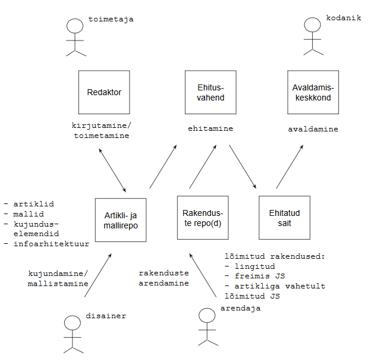

# CMS valikust
{: .no_toc}

{: .toc}

## Protsess

## Vajadused

Artiklite kirjutamine/toimetamine
- tekstitöötluse erifunktsioonid
- collaborative writing - EI
- mallid
- kujunduselemendid

Artiklite salvestamine
- jätkusuutlik vorming
- versioonihaldus

Lõimitud rakendused
- lõimimine artiklitega
  - lingitud rakendus
  - Javascript freimis
  - vahetult lõimitud Javascript

Ehitamine
- kiire ehitus- ja avaldamistsükkel
- staatiliselt ehitatud sait (soovituslik)
- incremental build (soovituslik)

# Soovitused

Redaktor | Otstarbekas on valida võimas, laiendatav tekstiredaktor. Tellida erifunktsioonide arendus. Sobida võiksid nt **Atom**, **Visual Studio Code**, põhimõtteliselt ka **Microsoft Word** vms. Kaks esimest on laiendatavad Javascript, kolmas Visual Basic keeles. Põhimõtteliselt võiks sobida ka **Confluence**. |
Artiklite salvestamine | Võtmeelemendid on jätkusuutlik vorming, masintöödeldavus ja versioonihaldus. Jätkusuutlikkus tähendab, et tekste saab vajadusel teise süsteemi üle kanda. Masintöödeldavus tähendab, et ehitusvahend saab tekstidest saidi ehitada. Versioonihaldus tähendab, et toimetaja saab aru, kui ta teise töö üle kirjutab. Reaalajas _collaborative writing_ minu meelest ei ole tingimata vajalik. Paremini vastavad nendele nõudmistele **Markdown** ja **git**.
Rakendused | Hoida **git** koodirepo(de)s tavalisel viisil 
Ehitusvahend | Genereerib artiklite, mallide, kujunduselementide, infoarhitektuuri põhjal saidi, sh lõimib rakendused
Avaldamiskeskkond | Ei nõua eritarkvara