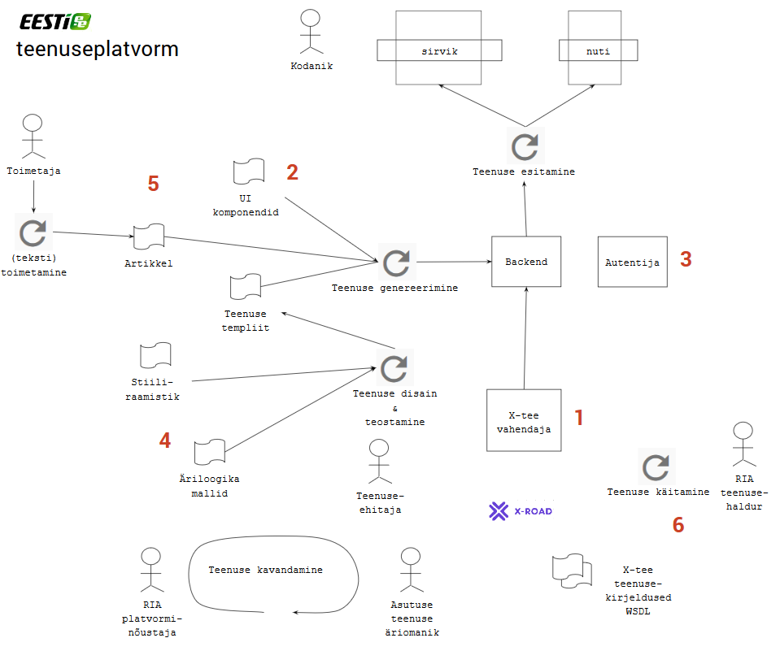

# Teenuseplatvormi kontseptsioon

## Mida pakume?

1  Lihtsat ligipääsu X-teele
- "X-tee vahendaja" toob teenusele vajalikud andmed X-tee andmekogudest
- andmed esitatakse JSON või lihtsas XML vormingus
- ei pea paigaldama ega haldama turvaserverit
- ei pea ise taotlema pääsuõigusi X-teel

2  Tipptasemel stiiliraamatut ja komponente UI teostamiseks
- kasutaja ei pea teenuse UI-d õppima
- stiililine ühtesobivus teiste teenustega
- oma stiili ja kohandamise võimalus

3  Teenuse kasutaja isiku tuvastamist
- soovi korral SSO-d, platvormil majutatud teenuste piires
- erinevad autentimisviisid
- piiriülene (eIDAS) autentimine

4  Malle teenuse äriloogika realiseerimiseks
- Angular
- Java

5  Teenuse ülesleitavust ja konteksti
- koht 3000 riigi infosüsteemi tutvustava artikli ja 100+ teenuse seas
- esindatus kodanikuteenuste teemakataloogis
- riigiportaali otsimootoris kajastamine

6  Teenusekäituse tugiteenust 
- te ei pea ise käitama
- ITIL standard
- monitooring
- intsidendilahendus
- kasutajatugi 
- infoturve
- \+ ca 10-15 erinevat lisateenust

## Tehnoloogiline protsess

Teenuse elukaar algab **teenuse kavandamisega**. See on dünaamiline protsess, kus osalevad asutuse poolt teenuse äriomanik ja RIA poolt platvorminõustaja.

Teenuse **disaini ja teostamise** käigus projekteeritakse teenuse välisilme, interaktsioon kasutajaga, selgitatakse välja andmekogudest päritavad andmed ja luuakse artifaktid, mis on vajalikud täitmisvalmis teenuse genereerimiseks. Sisenditena kasutatakse stiiliraamistikku, UI komponentide kirjeldusi, äriloogika malle ja X-tee vahendaja dokumentatsiooni.

Teenuse **genereerimise** etapp on automatiseeritud. Eelmisel etapil loodud masintöödeldavatest kirjeldustest teenusespetsiifilisest äriloogika koodist ja platvormi valmiskomponentidest ehitatakse täitmisvalmis teenusekood ja -andmestik.

Teenuse ettevalmistuse osaks on ka teenuse sidumine riigiportaali rikkaliku artiklite kogumiga.

Teenuse **esitamisel** toimub teenuse osutamine kodanikule.

Teenuse **käitamine** on backend-is pidevalt toimuv, kodaniku ja suurelt osalt ka asutuse eest varjestatud tegevuste kogum: monitooring, intsidentide lahendamine, jõudluse juhtimine, kasutajatugi, statistika tootmine, tagasiside kogumine jm. Asutus ise ei pea nende igapäevaste töödega tegelema.

